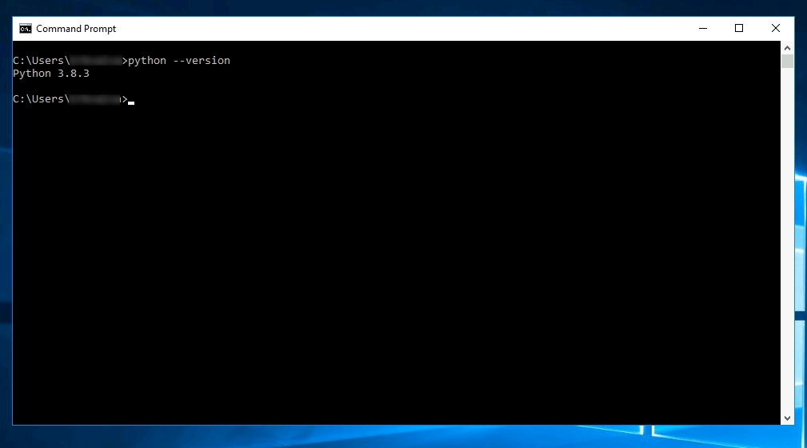
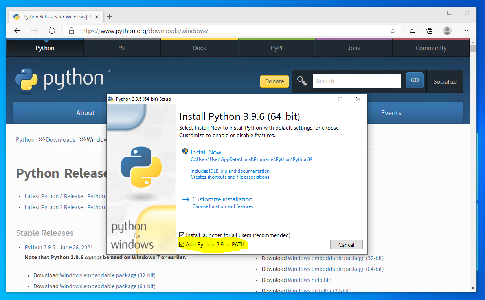

# User manual

## Contents

- [Installation](#installation)
  - [Dependencies](#dependencies)
  - [Windows](#windows)

## Installation

### Dependencies

Running `nina` requires:

- Python 3.8 or higher
- [`venv`](https://docs.python.org/3/library/venv.html) or
  [`virtualenv`](https://virtualenv.pypa.io) (recommended)
- The URL for downloading the package

### Windows

First check if required Python version is installed on your computer. Open
`cmd` and run the command `python --version` as showed in
example below. If you see an output of a supported Python version you are ready
to proceed. If not [download](https://www.python.org/downloads/windows/) and
install Python before proceeding. Ensure that the check box "Add Python `<version>`
to PATH" is checked.





Find url to latest `whl`
[here](https://github.com/MindTooth/fish-code/releases/latest) for use in
command below.

#### Install to user

If you do not want to install the application in a virtual environment,
install it to your user by running:

If your computer do not have a `gpu`:

<!-- prettier-ignore-start -->
```terminal
python -m pip install --user 'nina[cpu] @ <url>'

# example:
python -m pip install --user 'nina[cpu] @ https://github.com/MindTooth/fish-code/releases/download/v1.0.0/nina-1.0.0-py3-none-any.whl'
```
<!-- prettier-ignore-end -->

If your computer do have a `gpu`:

<!-- prettier-ignore-start -->
```terminal
python -m pip install --user 'nina[gpu] @ <url>' --find-links https://download.pytorch.org/whl/torch_stable.html

# example:
python -m pip install --user 'nina[gpu] @ https://github.com/MindTooth/fish-code/releases/download/v1.0.0/nina-1.0.0-py3-none-any.whl' --find-links https://download.pytorch.org/whl/torch_stable.html
```
<!-- prettier-ignore-end -->

To run the application call the `nina` command and from a browser go to the
local address `http://localhost:5000`.

#### Install in a virtual environment

Optionally if the application is to be installed in a virtual environment,
run the following commands to create the environment:

```terminal
python -m virtualenv venv
# or
python -m venv venv

# load environment
venv\Scripts\activate.bat

# update environment
python -m pip install --upgrade pip setuptools wheel
```

Then install the application in the virtual environment:

If your computer do not have a `gpu`:

```terminal
python -m pip install 'nina[cpu] @ <url>'
```

If your computer do have a `gpu`:

<!-- prettier-ignore-start -->
```terminal
python -m pip install 'nina[gpu] @ <url>' --find-links https://download.pytorch.org/whl/torch_stable.html
```
<!-- prettier-ignore-end -->

To run the application call the `nina` command and from a browser go to the
local address `http://localhost:5000`.

Next time you running the application the virtual environment need to be
activated before you can run the application.

```terminal
venv\Scripts\activate.bat
nina
```
