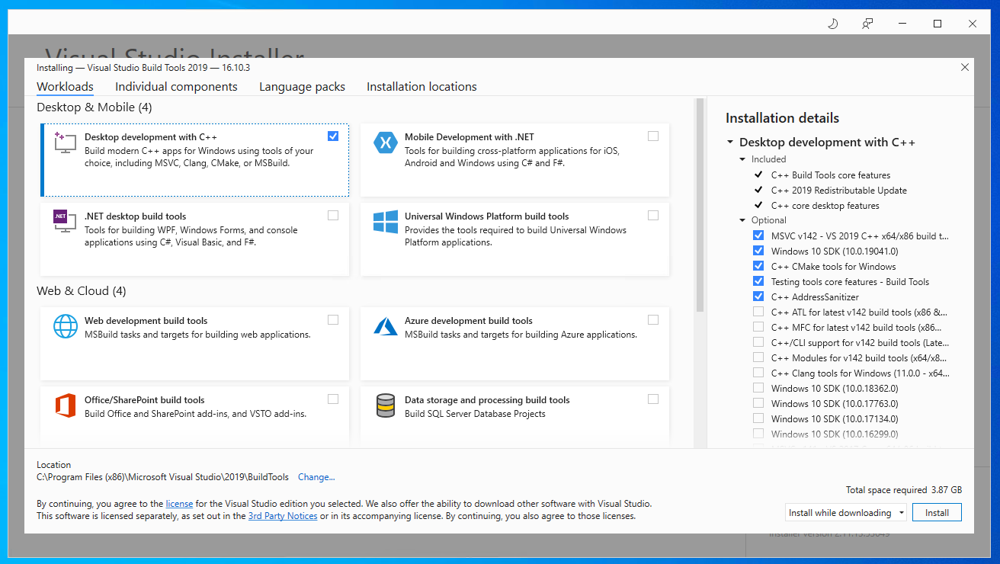

# User manual

## Contents

- [Installation](#installation)
  - [Dependencies](#dependencies)
  - [Windows](#windows)

## Installation

### Dependencies

- Python (3.8, 3.9)
- [`virtualenv`](https://virtualenv.pypa.io/en/latest/) (optional, but recommended)
- [Git](https://git-scm.com/downloads)

### Windows

**Extra Dependencies:**

- [Microsoft C++ Build Tools](https://visualstudio.microsoft.com/visual-cpp-build-tools/)

First check if required Python version is installed on your computer. Open
`powershell` or `cmd` and run the command `python --version` as showed in
example below. If you see an output of a supported Python version you are ready
to proceed. If not [download](https://www.python.org/downloads/windows/) and
install Python before proceeding. Ensure that the check box "Add Python `<version>`
to PATH" is checked.


When installing Microsoft C++ Build Tools, check the "Desktop development with
C++" box and hit install.



#### Install to user

If you do not want to install the application in a virtual environment,
install it to your user by running:

```terminal
py pip install --user 'git+https://github.com/MindTooth/fish-code'
```

To run the application call the `nina` command and from a browser go to the
local address `0.0.0.0:5000`.

#### Install in virtual environment

Optionally if the application is to be installed in a virtual environment,
run the following commands to create the environment:

```terminal
py virtualenv venv --download  # or `python -m venv venv --upgrade-deps`
. venv/bin/activate
```

Then install the application in the virtual environment:

```terminal
py pip install 'git+https://github.com/MindTooth/fish-code'
```

To run the application call the `nina` command and from a browser go to the
local address `0.0.0.0:5000`.

Next time you running the application the virtual environment need to be
activated before you can run the application.

```terminal
. venv/bin/activate
nina
```
